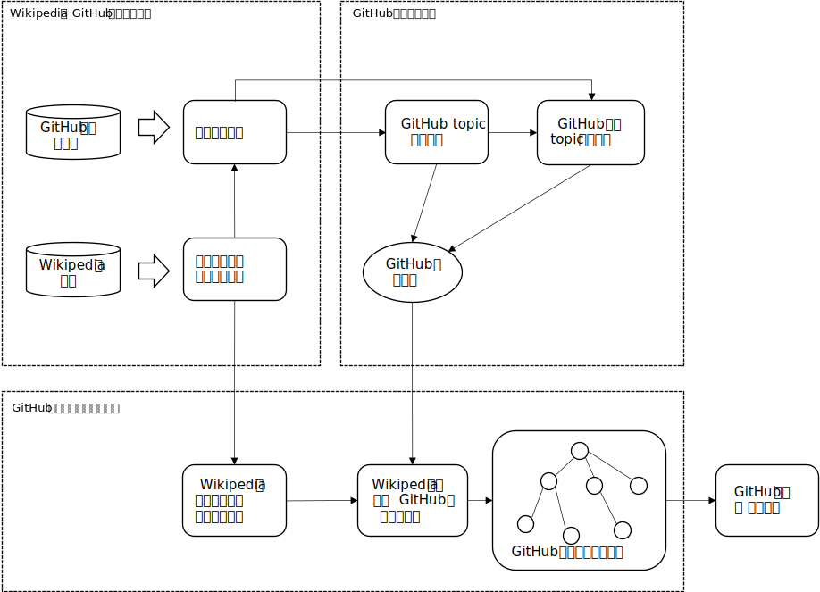

<h1 align="center">一种基于知识图谱的GitHub层次化学习和检索系统</h1>

## 项目背景与简介

### 1.项目背景

GitHub上具有很多软件开发相关的学习资源，但对于软件开发初学者来说也有着过于繁杂、难于检索的问题。

- 部分用户需求并不明确，难以准确地进行搜索

- 软件开发初学者由于软件开发经验和背景知识不足，可能难以用合适的关键词表达出搜索意图

同时，GitHub的搜索是基于搜索文本与仓库标题、仓库描述的文本匹配，并没有针对用户需求不明确的问题进行优化。因此，给软件开发初学者使用GitHub带来了一定的难题。

针对以上问题，可以挖掘GitHub仓库所涉及的概念之间存在的层次关系以辅助搜索，但GitHub官方并未提供这一关系

### 2. 项目简介

项目主要提供了以下几个方面的功能：

1. 对GitHub topic进行层次聚类，从而提取出GitHub仓库的类别层次，并实现了GitHub仓库topic类别预测方法，从而抽取出了GitHub层次结构
2. 结合Wikipedia数据和GitHub层次结构，构建出了GitHub软件开发知识图谱，设计了基于知识图谱的GitHub学习与检索算法。
3. 以Web应用形式，实现了GitHub层次化学习和检索系统，为用户提供层次化学习和检索GitHub的功能

项目的总体架构如下图：

## 项目结构

项目的根目录下主要有以下文件夹：

* `Algorithm`：项目构建知识图谱方法的主要代码
* `Github-flask-backend`：项目后端的主要代码和数据，包括Github层次化检索功能的实现
* `Frontend`：项目前端的主要代码和数据

## 项目部署

有关前端的部署，请参见`Frontend/README.md`。后端安装flask即可启动。

如要运行`Algorithm`中的知识图谱构建方法：数据准备部分对Wikipedia的爬取基于`selenium`，且使用了Chrome的webdriver，在运行之前，需要安装Chrome的webdriver，以使得`selenium`可以正确使用；在构建Github topic层级结构部分，使用BERT进行了仓库topic类别预测，配置方法如`Algorithm/HierGithub/Topic-Prediction/BERT/README.md`所述。

## 项目组成

项目主要由以下几个部分组成，我们可以结合项目简介中给出的整体项目结构图查看。

### 1. 数据准备：

`Wiki-crawler.py, Wiki-pages-crawler.py`：通过层次地遍历[Wikipedia Software development](https://en.wikipedia.org/wiki/Category:Software_development)其下的各个子分类和子页面，本文获取了软件开发领域的各个知识条目，共有超过27000个知识条目。

`WikitoGithubcrawler.py`：在获取的Wikipedia软件开发领域知识条目中，有部分包含开源代码的知识条目与GitHub仓库相关联，条目内容中包含指向GitHub仓库的链接。本文从Wikipedia页面的html源码中抽取指向GitHub仓库的链接，从而获取第一级与Wikipedia直接相连的GitHub仓库，共有2281个仓库。

仅仅与Wikipedia直接相连的2281个GitHub仓库显然不足以代表GitHub的仓库资源，也无法为软件开发初学者构建起一个GitHub的学习和检索系统。本文从这2281个GitHub仓库出发，将仓库范围扩展到GitHub上与软件开发相关的，比较具有代表性的仓库。具体做法如下：
1）`Stargazers-Fetching.py`：通过GitHub REST API获取在GitHub上对star了这2281个仓库的所有用户。由此，本文获得了全部2281个仓库的220余万名标星用户。平均每个仓库有将近1000名标星用户，可知Wikipedia直接链接到的这些GitHub仓库流行度较高。这些用户对star了Wikipedia软件开发领域链接到的GitHub仓库，说明他们对软件开发有着一定的兴趣，他们的其他star仓库也可能与软件开发相关。
2）`Starred-Repos-Extract.py, Starredrepos-Fetching.py`：在每个仓库的stargazer中，随机选取一名用户作为该仓库stargazer的代表，并爬取他的star仓库列表。由此本文获得了超过75万个GitHub仓库。
3）`Choose-Repos.py`：目前获取的超过75万个GitHub仓库数量庞大，但在质量上较为参差不齐。为了提高GitHub学习检索系统的仓库质量，本文使用仓库star数对仓库进行筛选，只留下star数不少于150的仓库，共有超过18万个仓库。
至此，本文成功获得了超过18万个与Wikipedia软件开发领域条目直接或间接相关的且认可度较高的GitHub仓库，以此作为本文将要实现的GitHub层次化学习和检索系统的基础。

`Gitrepoinfo-Crawling.py, One-Readme-Crawler.py`：本文通过GitHub REST API获取了每个仓库的star数、仓库描述、Readme文件、topic。

`Topic-Reflection.json`：由于GitHub topic由用户自主添加，没有统一的规范，因此存在许多同义但形式上略有不同的topics，如“c++”与“cpp”。本文使用Stack Overflow提供的同义词集合 将同义的topic归为同一类，便于后续分析处理。

### 2. 构建Github topic层次结构：

#### Hierarchical-Clustering

层次聚类：

`Topic.ipynb, TopicT2B.ipynb`：本文使用仓库的topic作为仓库的主要类别特征代表，对GitHub topic进行层次聚类，从而抽取出GitHub内部以topic簇为代表的层级结构。本文基于topic之间的共现关系，使用Leiden社区发现（community detection）算法对topic进行层次聚类。

本文获取了相关仓库的topic。在183805个仓库中，有94617个仓库具有topic。利用这些具有topic的仓库的信息，本文使用共现关系（topic对在同一个仓库中共现的次数）和Leiden算法对topic进行层次聚类，包括如下步骤：

1. 为了减少单个仓库对整体分析的影响，更好地体现topic的整体结构，对topic和topic对进行筛选，去除总出现次数不超过3的topic，对于仅在一个仓库中共同出现过的topic对，不计入它们的联系，即将它们的共现次数计为0，最后去除所有孤立的无共现topic的topic，得到17931个topic。
2. 统计所有topic对的共现次数（对于两个topic $t_a$ 和 $t_b$，它们的共现次数为同时含有 $t_a$ 和 $t_b$ 的仓库数量），构建topic的共现矩阵。
3. 根据共现矩阵，使用python工具包NetworkX 建立topic共现关系图。
4. 在topic共现关系图上调用python工具包leidenalg 的find_partition函数，该函数使用Leiden算法进行社区发现。
5. 对于前一步所得的社区，在其上继续应用Leiden算法，划分出新的社区。
6. 重复步骤5，直到所得的社区均不可被Leiden算法再分，完成topic的层次聚类过程。
本文构建出的topic层次聚类中共有4450个底层topic社区，从顶层社区到低层社区的最长路径为8。本文将一个topic社区称为一个topic簇。对于网络中的一个节点，度中心性是它与其他节点的直接联系总数，对于带权图来说，节点的度中心性是节点连边的权重之和。度中心性常用于衡量网络中节点的重要性，度中心性越大的节点在网络中越重要。本文使用每个topic簇里度中心性最大的topic作为该topic簇的代表topic。对于一个GitHub仓库，若其含有某个底层topic簇内的一个topic，则称该仓库与该topic簇具有联系。

### Topic-Prediction

仓库topic类别预测：

`BERT_preprocess.ipynb, Prediction.ipynb`：数据预处理

`BERT/`：基于BERT的分类器

由于GitHub仓库topic标注是由仓库作者自主进行的，具有随意性，且不是强制操作，因此有很大一部分GitHub仓库不含有topic。在本文选定的数据集中，有将近9万个仓库没有topic，然而本文的GitHub仓库学习与推荐需要建立GitHub社区的知识图谱，其中需要将仓库连接到层次聚类得到的topic簇。因此，对于对无topic的仓库，需要进行topic类别预测，为这些仓库补上仓库中隐含的topic。然而，topic类别过多，给topic类别预测带来困难，因此本文结合构建的topic层次聚类，使用层次分类方法，对于每个非叶子节点的topic簇构建一个基于BERT预训练模型的多标签分类器，最终得到仓库所连接的底层topic簇。

主要目标是为不含topic的仓库寻找相联系的底层topic簇，即确定仓库所属的topic类别，每个仓库可能关联多个底层topic簇，本质上是一个多标签分类问题。由于底层topic簇数量巨大，多标签分类难以进行，本文采用层次分类方法，利用层次聚类的结果作为类别层次。

由于底层topic簇数量过大，难以进行预测，本文的仓库topic类别预测基于GitHub提供的[featured topics](https://github.com/topics)进行。其中有个别topics在全GitHub上的仓库数量不足100个，样本数量过小，因此本文将它们剔除，最后剩余175个featured topics，后文所提到的featured topics均指剔除后的175个featured topics。本文在159个含featured topic的底层topic簇中为不含topic的仓库寻找关联的topic簇。

topic层次聚类最终得到一棵topic簇树，本文抽取出由含有featured topic的topic簇构成的子树，并保留每个簇中的featured topic，从而得到了featured topics的层次聚类，作为仓库topic类别预测的类别层次。本文利用该类别层次，将一个159标签的多标签分类器拆分为74个标签数量较少的多标签分类器。为了促进数据的平衡性，加强多标签分类的效果，本文为每个featured topic采样了100个含有该topic的仓库，并按9:1的比例划分为训练集和测试集。预测模型训练的具体步骤如下：

1. 对于featured topics的层次聚类树中每一个非叶子节点的topic簇，选取训练样本仓库中与该topic簇存在关联的仓库作为该topic簇分类器的训练样本。每个训练样本的数据输入为该仓库的描述文本(description+readme)，期望输出为该仓库在当前topic簇的子topic簇中实际存在关联的topic簇。
2. 对于featured topics的层次聚类树中每一个非叶子节点的topic簇，假设当前topic簇将被分为 $T_1…T_k$ 这k个子topic簇，在该topic簇的训练样本上训练一个k标签的多标签分类器。
3. 每个多标签分类器的结构如下：将每个训练样本的描述文本输入分类器模型的BERT编码层，获得该描述文本的文档向量，该向量包含了该训练样本仓库描述文本的语义特征，将该向量输入模型的全连接层，最终通过Sigmoid层输出，得到该仓库每个可能标签的概率预测。

训练完成后，对于不含topic的仓库，使用该预测模型进行topic簇预测。具体来说，将仓库的描述文本输入每个分类器，得到每个分类器上各个topic簇的概率输出。综合结果时，类别层次中根节点的概率为1，假设某topic簇节点的概率为p，该topic簇向下分为k个子topic簇，该topic簇分类器对于第i子topic簇的概率输出为 $p_i (i=1,2,…,k)$ ，则第i个子topic簇的的概率为 $p*p_i$ ，递归向下可以得到每个topic簇的概率。由此得到了仓库与每个底层topic簇相联系的概率，本文取其中概率最大的前三个topic簇，将仓库与它们相联系。

## Knowledge-Graph-Building

知识图谱构建：

对于Wikipedia知识条目，本文依据Wikipedia知识图谱中知识条目间的上下级关系将它们进行连接，组织为Wikipedia软件开发领域层级知识树。

Wikipedia软件开发领域层级知识树构建后，需要与GitHub层级结构进行连接，从而对Wikipedia软件开发领域层级知识树进行扩展，构成完整的GitHub软件开发知识图谱。

`Wikimatch.ipynb`：本文设计的Wikipedia软件开发领域层级知识树与GitHub层级结构的连接方法如下：将Wikipedia软件开发领域层级知识树的叶子节点与本文所涉及的GitHub topics进行文本匹配，假如一个叶子节点在GitHub topics中有匹配topic，说明该叶子节点的知识有在GitHub上继续延伸的可能。假如一个Wikipedia软件开发领域层级知识树的叶子节点E在GitHub topics中与topic T相匹配，则在topic层次聚类结果中寻找以topic T为代表topic的topic簇。Topic T在topic簇中是代表topic，即topic T在该topic簇中的度中心性最大，假如将该topic簇看作一个知识点，则该知识点的内容是围绕topic T展开的。假如topic T是topic簇 $C_1,C_2,…,C_n$ 的代表topic， $C_1,C_2,…,C_n$ 之间应当存在层次关系。选择 $C_1,C_2,…,C_n$ 中层次最高的topic簇 $C_k$ ，将E与 $C_k$ 连接。

通过上述连接，topic层次聚类获得的topic簇中，仅有9个topic簇无法连接到Wikipedia软件开发领域层级知识树，它们均为topic层次聚类中第一次对topic运用社区发现所获得的topic社区，且规模小，无法再分为更小的社区，因此无子topic簇。本文将这9个topic簇连接到Wikipedia软件开发领域层级知识树的根节点，从而将所有topic簇都与Wikipedia软件开发领域层级知识树建立了联系。

`GraphCon.ipynb`：在建成的图的Wikipedia软件开发领域层级知识树部分中，递归删除无法连接到GitHub topic簇的叶子节点，直到Wikipedia软件开发领域层级知识树中的每个知识条目通过在图中向下延伸都可以到达topic簇。至此，本文构建了完整的GitHub软件开发知识图谱，保存在Knowledge-Graph-Building/WholeKnowledgeGraph.json中。

`BackendData.ipynb`：处理获得后端层次化学习和检索所需的数据
